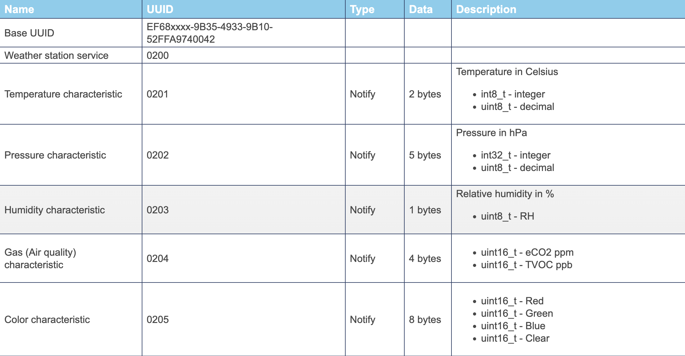

# NORDIC THINGY52 ACTIVITY RECOGNITION

***

The project's aim is to build a well structured framework able to perform __real-time__ activity recognition, represented by data acquired through the Thingy52 sensor.

***

The Nordic Thingy:52 enables developers with no firmware coding expertise or high-level tools to quickly design and demonstrate IoT projects.
It is provided with the Bluetooth protocol, allowing different devices to establish a communication. The feature I was more interested in for this project were the numerous BLE services exposed by the sensor, that could be activated through the so called UUID.
Each BLE service is represented by a name, a UUID, a type (explain what kind of operation you can perform on it such as read/write/notify), a number of bytes representing the data, and a description of its function. Below a simple example:

more examples can be found here:

https://nordicsemiconductor.github.io/Nordic-Thingy52-FW/documentation/firmware_architecture.html

1) introduce what is the project about and then what is the purpose
2) give a brief explanation of how the thingy52 works, with some docs/images
3) briefly explain how theproject works
4) display the file tree
5) explain sequence of commands to make it work
6) put final results
7) clearly state the skills learned from this project
